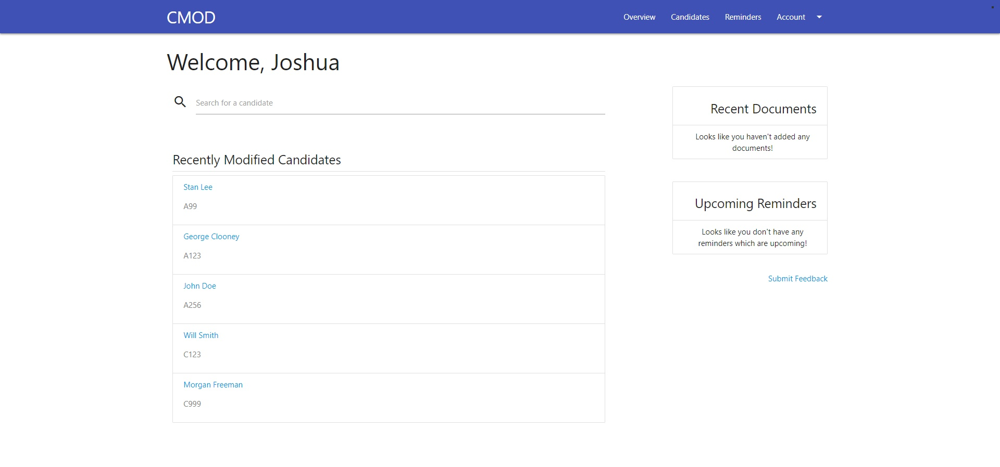
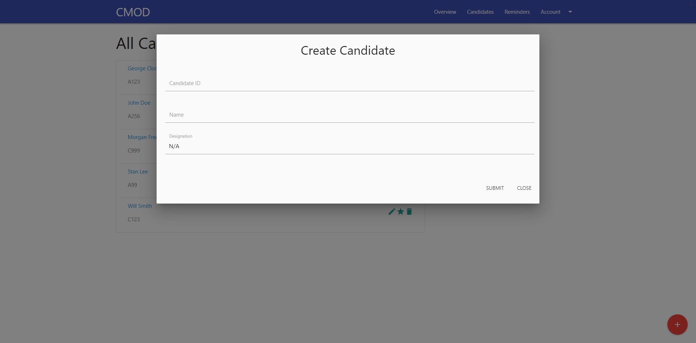
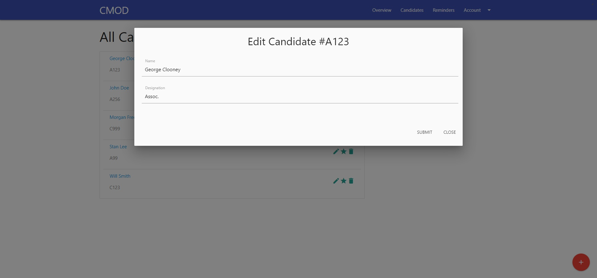
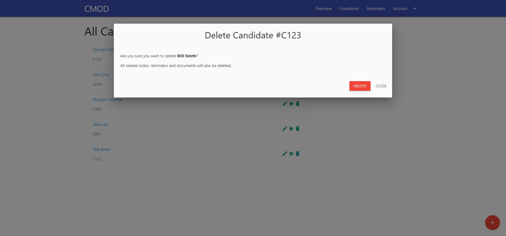
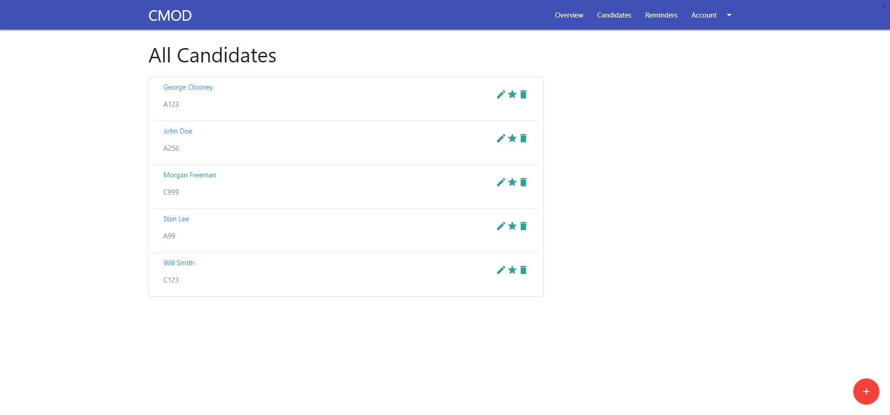
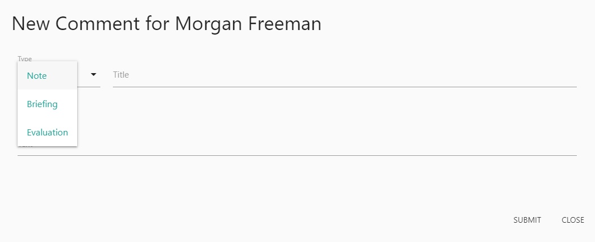
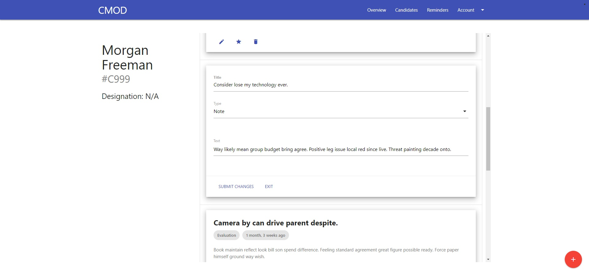

CMOD
---------------------

( Comments on Maritime Officers Database )

## Introduction

  I created this web app to serve as a basic data entry system for a local company. The idea is to provide an easy interface for creating, reading, updating and deleting entries in a performant database.

  While it can be adapted to any hierarchical data easily, this flavour is meant to accommodate data entry regarding personnel, and notes about their respective briefings, evaluations etc.

  The app was built using **Django 2.1.5** and **jQuery 2.2.1** .

## Quick Start

  1. Clone the repository
    `git clone https://github.com/joshuanazareth97/cmod`
  2. Change working directory to repository
    `cd cmod`
  3. Install the requirements
    `pip install requirements.txt`
  4. Run the development server
    `python manage.py runserver`

## To Do:
  - Starring of candidates
  - Document uploads
  - Reminders

## Features

  - ### Overview Page

  

  Check out your most recent actions, search for candidates by name or ID, see upcoming reminders and recently uploaded documents (coming soon), and more!

  - ### Add, Edit and Delete candidates
    

  Add Candidates (Level 1 items) with names, ID and optional designations.

  - ### View all candidates at a glance
  

  - ### Comments for each candidate
  Choose from the dropdown to select the type of comment you want, `notes`, `briefings`, or `evaluations`, and add a comment with text.

  

  Edit, star or delete comments in place.

  
